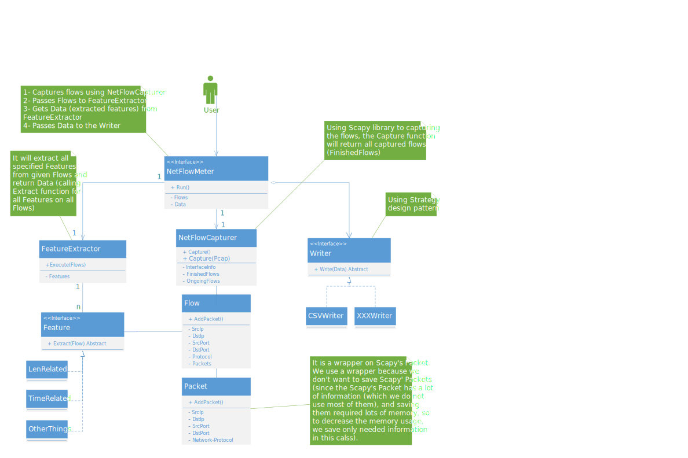

# NTLFlowLyzer

As part of the Understanding Cybersecurity Series (UCS), NTLFlowLyzer is a Python open-source project to extract network layer features from TCP-based network traffic for Anomaly Profiling (AP) which is the second component of the [**NetFlowLyzer**](https://github.com/ahlashkari/NetFlowLyzer).

NTLFlowLyzer generates bidirectional flows from the Network and Transportation Layers of network traffic, where the first packet determines the forward (source to destination) and backward (destination to source) directions, hence the statistical time-related features can be calculated separately in the forward and backward directions. Additional functionalities include selecting features from the list of existing features, adding new features, and controlling the duration of flow timeout. Moreover, TCP flows are terminated upon connection teardown (by FIN or RST packet), reaching the flow's maximum duration, or being inactive for a certain amount of time (timeout).


# Table of Contents

- [NTLFlowLyzer](#ntlflowlyzer)
- [Table of Contents](#table-of-contents)
- [Installation](#installation)
- [Execution](#execution)
- [Architecture](#architecture)
- [Extracted Features](#extracted-features)
  - [Definitions](#definitions)
  - [Statistical Information Calculation](#statistical-information-calculation)
- [Output](#output)
- [Copyright (c) 2023](#copyright-c-2023)
- [Contributing](#contributing)
- [Project Team members](#project-team-members)
- [Acknowledgment](#acknowledgment)

# Installation

Before installing or running the NTLFlowLyzer package, it's essential to set up the necessary requirements on your system. Begin by ensuring you have both `Python` and `pip` installed and functioning properly (execute the `pip3 --version` command). Then, execute the following command:

```bash
pip3 install -r requirements.txt
```

You are prepared to install NTLFlowLyzer. To proceed, execute the following command in the package's root directory (where the setup.py file is located), which will install the NTLFlowLyzer package on your system:

### On Linux:
```bash
python3 setup.py install
```

### On Windows:
```bash
pip3 install .
```

After successfully installing the package, confirm the installation by running the following command:

```bash
ntlflowlyzer --version
```


# Execution

The core aspect of running NTLFlowLyzer involves preparing the configuration file. This file is designed to facilitate users in customizing the program's behavior with minimal complexity and cost, thus enhancing program scalability. Below, we outline how to prepare the configuration file and subsequently demonstrate how to execute NTLFlowLyzer using it.

## Configuration File

The configuration file is formatted in `JSON`, comprising key-value pairs that enable customization of the package. While some keys are mandatory, others are optional. Below, each key is explained along with its corresponding value:

* **pcap_file_address** [Required]
  
  This key specifies the input PCAP file address. The format of the value should be a string.
  
  **Note**: At this version of NTLFlowLyzer, we only support the `PCAP` format. For other formats such as `PCAPNG`, you must convert them to `PCAP`. To convert `PCAPNG` to `PCAP`, you can use Wireshark. If you prefer command-line tools, you can use the following command:

  ```bash
  tshark -F pcap -r {pcapng_file} -w {pcap_file}
  ```

  Replace `{pcapng_file}` with the path to your PCAPNG file and `{pcap_file}` with the desired output PCAP file name.

* **output_file_address** [Required]

  This key specifies the output CSV file address. The format of the value should be a string.

* **label** [Optional]

  This key specifies the value of the `label` column in the output CSV file address. The format of the value should be a string. The default value is `Unknown`.


* **number_of_threads** [Optional]

  This key specifies the number of threads to be used for all processes, including flow extraction, feature calculation, and output writing. The value must be an integer of at least `3`. The default value is `4`.

  It's important to consider that the optimal value for this option varies based on the system configuration and the format of the input PCAP file. For instance, if the PCAP file contains a large number of packets (e.g., more than 5 million) and they are all TCP packets, increasing the number of threads might be beneficial. However, if the packets represent a small number of flows and all related packets are contiguous, adding more threads could potentially slow down the program since there are fewer distinct flows.

  As a rule of thumb, the ideal value for this option typically falls between half the number of CPU cores (CPU count) and twice the CPU count. This helps balance computational resources without overwhelming the system. (`0.5 * cpu_count < best_option < 2 * cpu_count`)


* **feature_extractor_min_flows** [Optional]

  This key determines the minimum number of finished flows required for the feature extractor thread to initiate its work and extract features from these finished flows. The value must be an integer. The default value is `4000`.

  Selecting a high value for this option will consume more RAM since more flows will be stored in memory, potentially slowing down the entire program. Conversely, choosing a low value for this option can slow down the execution process, as it involves locking the finished flows list and then copying those flows for feature extraction. These two processes, locking and copying, are slow and can impede other program components.


* **writer_min_rows** [Optional]

  This key specifies the minimum number of ready flows (i.e., finished flows from which features have been extracted) required for the writer thread to begin its work of writing the flows to the CSV file. The value must be an integer. The default value is `6000`.

  Opting for a high value for this option will increase RAM usage since more flows will be stored in memory, potentially slowing down the overall program performance. Conversely, selecting a low value for this option can slow down the execution process, involving locking the finished flows list, copying those flows for the writing process, and performing I/O operations to write to the file. These three processes — locking, copying, and I/O — are slow and may impede other program components.
  
* **read_packets_count_value_log_info** [Optional]

  This key determines the minimum number of processed packets (i.e., the number of packets read from the PCAP file and assigned to a flow) required for the logger to log. The value must be an integer. The default value is `10,000`. This means that after processing every `10,000` packets, the program will print a statement indicating the number of packets analyzed.


* **check_flows_ending_min_flows** [Optional]

  This key specifies the minimum number of ongoing flows (i.e., created flows that have not yet finished) required for checking if they have reached the timeout or maximum flow time value. The value must be an integer. The default value is `2000`. This indicates that if the number of ongoing flows exceeds `2000`, the program will proceed to check all flows for timeout or maximum flow time.


* **capturer_updating_flows_min_value** [Optional]

  This key determines the minimum number of finished flows required to be added to the queue for feature extraction. The value must be an integer. The default value is `2000`. This means that if the number of finished flows exceeds `2000`, the program will move them to a separate list for the feature extractor.
  

* **max_flow_duration** [Optional]

  This key sets the maximum duration of a flow in seconds. The value must be an integer. The default value is `120,000`. It means if the flow duration exceeds `120,000` seconds, the program will terminate the flow and initiate a new one.


* **activity_timeout** [Optional]

  This key defines the flow activity timeout in seconds. The value must be an integer. The default value is `5000`. It means if `5000` seconds have elapsed since the last packet of the flow, the program will terminate the flow.


* **floating_point_unit** [Optional]

  This key specifies the floating point unit used for the feature extraction process. The value must be in the format: `.[UNIT]f`. The default value is `.4f`. This indicates that the feature values will be rounded to the fourth decimal place.


* **max_rows_number** [Optional]

  This key defines the maximum number of rows in the output CSV file. The value must be an integer. The default value is `900,000`. It means if there are more than `900,000` flows to be written in the CSV file, the program will close the current CSV file and create a new one for the remaining flows.


* **features_ignore_list** [Optional]

  This key specifies the features that you do not want to extract. The value must be a list of string values, where each string represents a feature name. The default value is an empty list. If you include a feature name in this list, the program will skip extracting that feature, and it will not appear in the output CSV file.


An example of a configuration file would be like this:

```json
{
    "pcap_file_address": "/mnt/c/dataset/my_pcap_file.pcap",
    "output_file_address": "./output-of-my_pcap_file.csv",
    "label": "Benign",
    "number_of_threads": 4,
    "feature_extractor_min_flows": 2500,
    "writer_min_rows": 1000,
    "read_packets_count_value_log_info": 1000000,
    "check_flows_ending_min_flows": 20000,
    "capturer_updating_flows_min_value": 5000,
    "max_flow_duration": 120000,
    "activity_timeout": 300,
    "floating_point_unit": ".4f",
    "max_rows_number": 800000,
    "features_ignore_list": ["duration", "src_ip"]
}
```


In general, we recommend adjusting the values of the following options: `number_of_threads`, `feature_extractor_min_flows`, `writer_min_rows`, `check_flows_ending_min_flows`, and `capturer_updating_flows_min_value`, based on your system configuration. This is particularly important if your PCAP file is large (usually more than 4 GB with over 1 million TCP packets), to optimize program efficiency.


## Argument Parser

You can use `-h` to see different options of the program.

To execute NTLFlowLyzer, simply run the following command:

```bash
ntlflowlyzer -c YOUR_CONFIG_FILE
```

Replace `YOUR_CONFIG_FILE` with the path to your configuration file.


Moreover, this project has been successfully tested on Ubuntu 20.04, Ubuntu 22.04, Windows 10, and Windows 11. It should work on other versions of Ubuntu OS (or even Debian OS) as long as your system has the necessary Python3 packages (you can find the required packages listed in the `requirements.txt` file).


# Architecture




                
----

# Extracted Features

We currently have 348 features that are as follows (features' explanation will be added):

1. flow_id
1. src_ip
1. src_port
1. dst_ip
1. dst_port
1. protocol
1. timestamp
1. Duration
1. PacketsCount
1. FwdPacketsCount
1. BwdPacketsCount
1. TotalPayloadBytes
1. FwdTotalPayloadBytes
1. BwdTotalPayloadBytes
1. PayloadBytesMax
1. PayloadBytesMin
1. PayloadBytesMean
1. PayloadBytesStd
1. PayloadBytesVariance
1. PayloadBytesMedian
1. PayloadBytesSkewness
1. PayloadBytesCov
1. PayloadBytesMode
1. FwdPayloadBytesMax
1. FwdPayloadBytesMin
1. FwdPayloadBytesMean
1. FwdPayloadBytesStd
1. FwdPayloadBytesVariance
1. FwdPayloadBytesMedian
1. FwdPayloadBytesSkewness
1. FwdPayloadBytesCov
1. FwdPayloadBytesMode
1. BwdPayloadBytesMax
1. BwdPayloadBytesMin
1. BwdPayloadBytesMean
1. BwdPayloadBytesStd
1. BwdPayloadBytesVariance
1. BwdPayloadBytesMedian
1. BwdPayloadBytesSkewness
1. BwdPayloadBytesCov
1. BwdPayloadBytesMode
1. TotalHeaderBytes
1. MaxHeaderBytes
1. MinHeaderBytes
1. MeanHeaderBytes
1. StdHeaderBytes
1. MedianHeaderBytes
1. SkewnessHeaderBytes
1. CoVHeaderBytes
1. ModeHeaderBytes
1. VarianceHeaderBytes
1. FwdTotalHeaderBytes
1. FwdMaxHeaderBytes
1. FwdMinHeaderBytes
1. FwdMeanHeaderBytes
1. FwdStdHeaderBytes
1. FwdMedianHeaderBytes
1. FwdSkewnessHeaderBytes
1. FwdCoVHeaderBytes
1. FwdModeHeaderBytes
1. FwdVarianceHeaderBytes
1. BwdTotalHeaderBytes
1. BwdMaxHeaderBytes
1. BwdMinHeaderBytes
1. BwdMeanHeaderBytes
1. BwdStdHeaderBytes
1. BwdMedianHeaderBytes
1. BwdSkewnessHeaderBytes
1. BwdCoVHeaderBytes
1. BwdModeHeaderBytes
1. BwdVarianceHeaderBytes
1. FwdSegmentSizeMean
1. FwdSegmentSizeMax
1. FwdSegmentSizeMin
1. FwdSegmentSizeStd
1. FwdSegmentSizeVariance
1. FwdSegmentSizeMedian
1. FwdSegmentSizeSkewness
1. FwdSegmentSizeCov
1. FwdSegmentSizeMode
1. BwdSegmentSizeMean
1. BwdSegmentSizeMax
1. BwdSegmentSizeMin
1. BwdSegmentSizeStd
1. BwdSegmentSizeVariance
1. BwdSegmentSizeMedian
1. BwdSegmentSizeSkewness
1. BwdSegmentSizeCov
1. BwdSegmentSizeMode
1. SegmentSizeMean
1. SegmentSizeMax
1. SegmentSizeMin
1. SegmentSizeStd
1. SegmentSizeVariance
1. SegmentSizeMedian
1. SegmentSizeSkewness
1. SegmentSizeCov
1. SegmentSizeMode
1. FwdInitWinBytes
1. BwdInitWinBytes
1. ActiveMin
1. ActiveMax
1. ActiveMean
1. ActiveStd
1. ActiveMedian
1. ActiveSkewness
1. ActiveCoV
1. ActiveMode
1. ActiveVariance
1. IdleMin
1. IdleMax
1. IdleMean
1. IdleStd
1. IdleMedian
1. IdleSkewness
1. IdleCoV
1. IdleMode
1. IdleVariance
1. BytesRate
1. FwdBytesRate
1. BwdBytesRate
1. PacketsRate
1. BwdPacketsRate
1. FwdPacketsRate
1. DownUpRate
1. AvgFwdBytesPerBulk
1. AvgFwdPacketsPerBulk
1. AvgFwdBulkRate
1. AvgBwdBytesPerBulk
1. AvgBwdPacketsPerBulk
1. AvgBwdBulkRate
1. FwdBulkStateCount
1. FwdBulkSizeTotal
1. FwdBulkPacketCount
1. FwdBulkDuration
1. BwdBulkStateCount
1. BwdBulkSizeTotal
1. BwdBulkPacketCount
1. BwdBulkDuration
1. FINFlagCounts
1. PSHFlagCounts
1. URGFlagCounts
1. ECEFlagCounts
1. SYNFlagCounts
1. ACKFlagCounts
1. CWRFlagCounts
1. RSTFlagCounts
1. FwdFINFlagCounts
1. FwdPSHFlagCounts
1. FwdURGFlagCounts
1. FwdECEFlagCounts
1. FwdSYNFlagCounts
1. FwdACKFlagCounts
1. FwdCWRFlagCounts
1. FwdRSTFlagCounts
1. BwdFINFlagCounts
1. BwdPSHFlagCounts
1. BwdURGFlagCounts
1. BwdECEFlagCounts
1. BwdSYNFlagCounts
1. BwdACKFlagCounts
1. BwdCWRFlagCounts
1. BwdRSTFlagCounts
1. FINFlagPercentageInTotal
1. PSHFlagPercentageInTotal
1. URGFlagPercentageInTotal
1. ECEFlagPercentageInTotal
1. SYNFlagPercentageInTotal
1. ACKFlagPercentageInTotal
1. CWRFlagPercentageInTotal
1. RSTFlagPercentageInTotal
1. FwdFINFlagPercentageInTotal
1. FwdPSHFlagPercentageInTotal
1. FwdURGFlagPercentageInTotal
1. FwdECEFlagPercentageInTotal
1. FwdSYNFlagPercentageInTotal
1. FwdACKFlagPercentageInTotal
1. FwdCWRFlagPercentageInTotal
1. FwdRSTFlagPercentageInTotal
1. BwdFINFlagPercentageInTotal
1. BwdPSHFlagPercentageInTotal
1. BwdURGFlagPercentageInTotal
1. BwdECEFlagPercentageInTotal
1. BwdSYNFlagPercentageInTotal
1. BwdACKFlagPercentageInTotal
1. BwdCWRFlagPercentageInTotal
1. BwdRSTFlagPercentageInTotal
1. FwdFINFlagPercentageInFwdPackets
1. FwdPSHFlagPercentageInFwdPackets
1. FwdURGFlagPercentageInFwdPackets
1. FwdECEFlagPercentageInFwdPackets
1. FwdSYNFlagPercentageInFwdPackets
1. FwdACKFlagPercentageInFwdPackets
1. FwdCWRFlagPercentageInFwdPackets
1. FwdRSTFlagPercentageInFwdPackets
1. BwdFINFlagPercentageInBwdPackets
1. BwdPSHFlagPercentageInBwdPackets
1. BwdURGFlagPercentageInBwdPackets
1. BwdECEFlagPercentageInBwdPackets
1. BwdSYNFlagPercentageInBwdPackets
1. BwdACKFlagPercentageInBwdPackets
1. BwdCWRFlagPercentageInBwdPackets
1. BwdRSTFlagPercentageInBwdPackets
1. PacketsIATMean
1. PacketsIATStd
1. PacketsIATMax
1. PacketsIATMin
1. PacketsIATSum
1. PacketsIATMedian
1. PacketsIATSkewness
1. PacketsIATCoV
1. PacketsIATMode
1. PacketsIATVariance
1. FwdPacketsIATMean
1. FwdPacketsIATStd
1. FwdPacketsIATMax
1. FwdPacketsIATMin
1. FwdPacketsIATSum
1. FwdPacketsIATMedian
1. FwdPacketsIATSkewness
1. FwdPacketsIATCoV
1. FwdPacketsIATMode
1. FwdPacketsIATVariance
1. BwdPacketsIATMean
1. BwdPacketsIATStd
1. BwdPacketsIATMax
1. BwdPacketsIATMin
1. BwdPacketsIATSum
1. BwdPacketsIATMedian
1. BwdPacketsIATSkewness
1. BwdPacketsIATCoV
1. BwdPacketsIATMode
1. BwdPacketsIATVariance
1. SubflowFwdPackets
1. SubflowBwdPackets
1. SubflowFwdBytes
1. SubflowBwdBytes
1. DeltaStart
1. HandshakeDuration
1. HandshakeState
1. PacketsDeltaTimeMin
1. PacketsDeltaTimeMax
1. PacketsDeltaTimeMean
1. PacketsDeltaTimeMode
1. PacketsDeltaTimeVariance
1. PacketsDeltaTimeStd
1. PacketsDeltaTimeMedian
1. PacketsDeltaTimeSkewness
1. PacketsDeltaTimeCoV
1. BwdPacketsDeltaTimeMin
1. BwdPacketsDeltaTimeMax
1. BwdPacketsDeltaTimeMean
1. BwdPacketsDeltaTimeMode
1. BwdPacketsDeltaTimeVariance
1. BwdPacketsDeltaTimeStd
1. BwdPacketsDeltaTimeMedian
1. BwdPacketsDeltaTimeSkewness
1. BwdPacketsDeltaTimeCoV
1. FwdPacketsDeltaTimeMin
1. FwdPacketsDeltaTimeMax
1. FwdPacketsDeltaTimeMean
1. FwdPacketsDeltaTimeMode
1. FwdPacketsDeltaTimeVariance
1. FwdPacketsDeltaTimeStd
1. FwdPacketsDeltaTimeMedian
1. FwdPacketsDeltaTimeSkewness
1. FwdPacketsDeltaTimeCoV
1. PacketsDeltaLenMin
1. PacketsDeltaLenMax
1. PacketsDeltaLenMean
1. PacketsDeltaLenMode
1. PacketsDeltaLenVariance
1. PacketsDeltaLenStd
1. PacketsDeltaLenMedian
1. PacketsDeltaLenSkewness
1. PacketsDeltaLenCoV
1. BwdPacketsDeltaLenMin
1. BwdPacketsDeltaLenMax
1. BwdPacketsDeltaLenMean
1. BwdPacketsDeltaLenMode
1. BwdPacketsDeltaLenVariance
1. BwdPacketsDeltaLenStd
1. BwdPacketsDeltaLenMedian
1. BwdPacketsDeltaLenSkewness
1. BwdPacketsDeltaLenCoV
1. FwdPacketsDeltaLenMin
1. FwdPacketsDeltaLenMax
1. FwdPacketsDeltaLenMean
1. FwdPacketsDeltaLenMode
1. FwdPacketsDeltaLenVariance
1. FwdPacketsDeltaLenStd
1. FwdPacketsDeltaLenMedian
1. FwdPacketsDeltaLenSkewness
1. FwdPacketsDeltaLenCoV
1. HeaderBytesDeltaLenMin
1. HeaderBytesDeltaLenMax
1. HeaderBytesDeltaLenMean
1. HeaderBytesDeltaLenMode
1. HeaderBytesDeltaLenVariance
1. HeaderBytesDeltaLenStd
1. HeaderBytesDeltaLenMedian
1. HeaderBytesDeltaLenSkewness
1. HeaderBytesDeltaLenCoV
1. BwdHeaderBytesDeltaLenMin
1. BwdHeaderBytesDeltaLenMax
1. BwdHeaderBytesDeltaLenMean
1. BwdHeaderBytesDeltaLenMode
1. BwdHeaderBytesDeltaLenVariance
1. BwdHeaderBytesDeltaLenStd
1. BwdHeaderBytesDeltaLenMedian
1. BwdHeaderBytesDeltaLenSkewness
1. BwdHeaderBytesDeltaLenCoV
1. FwdHeaderBytesDeltaLenMin
1. FwdHeaderBytesDeltaLenMax
1. FwdHeaderBytesDeltaLenMean
1. FwdHeaderBytesDeltaLenMode
1. FwdHeaderBytesDeltaLenVariance
1. FwdHeaderBytesDeltaLenStd
1. FwdHeaderBytesDeltaLenMedian
1. FwdHeaderBytesDeltaLenSkewness
1. FwdHeaderBytesDeltaLenCoV
1. PayloadBytesDeltaLenMin
1. PayloadBytesDeltaLenMax
1. PayloadBytesDeltaLenMean
1. PayloadBytesDeltaLenMode
1. PayloadBytesDeltaLenVariance
1. PayloadBytesDeltaLenStd
1. PayloadBytesDeltaLenMedian
1. PayloadBytesDeltaLenSkewness
1. PayloadBytesDeltaLenCoV
1. BwdPayloadBytesDeltaLenMin
1. BwdPayloadBytesDeltaLenMax
1. BwdPayloadBytesDeltaLenMean
1. BwdPayloadBytesDeltaLenMode
1. BwdPayloadBytesDeltaLenVariance
1. BwdPayloadBytesDeltaLenStd
1. BwdPayloadBytesDeltaLenMedian
1. BwdPayloadBytesDeltaLenSkewness
1. BwdPayloadBytesDeltaLenCoV
1. FwdPayloadBytesDeltaLenMin
1. FwdPayloadBytesDeltaLenMax
1. FwdPayloadBytesDeltaLenMean
1. FwdPayloadBytesDeltaLenMode
1. FwdPayloadBytesDeltaLenVariance
1. FwdPayloadBytesDeltaLenStd
1. FwdPayloadBytesDeltaLenMedian
1. FwdPayloadBytesDeltaLenSkewness
1. FwdPayloadBytesDeltaLenCoV

## Definitions

In this section, we provide clear definitions for several category of features essential for understanding network traffic analysis within the context of the NTLFlowLyzer.

### 1.1. Flow Bulk Calculation

Flow bulk is determined based on certain criteria such as the number of packets transferred within a short time interval
or a specific pattern of packet transmission. In NTLFlowLyzer, flow bulk is identified based on the following criteria:
* A bulk transfer is initiated when a certain number of consecutive packets are observed within a short time frame (1
second in this case).
* The bulk transfer is considered terminated if the gap between subsequent packets exceeds the defined threshold (1
second).
* During a bulk transfer, packet count, total size of transferred data, and duration are accumulated.
* The flow maintains separate attributes (fbulkDuration, fbulkPacketCount, fbulkSizeTotal, fbulkStateCount) to track
these bulk transfer characteristics.

*Example*: For a flow, the bulk transfer is initiated when 5 consecutive packets are transferred within 1 second. During the bulk transfer, the flow's `fbulkPacketCount` is incremented, and the total size of the data transferred is accumulated in `fbulkSizeTotal`. If the gap between packets exceeds 1 second, the bulk transfer is terminated, and `fbulkDuration` records the total duration.


### 1.2. Subflow Calculation
Subflows are identified based on changes in packet transmission patterns within the flow. In NTLFlowLyzer, subflows are
calculated as follows:

* Subflow count (sfcount) is incremented whenever there’s a gap of more than 1 second between consecutive packets.

* This indicates a potential change in the transmission pattern, suggesting the beginning of a new subflow.

* The subflow count provides insights into how many distinct patterns of packet transmission occurred within the flow.

*Example*: A flow's subflow count (`sfcount`) is incremented each time there's a gap of more than 1 second between packets. This indicates a change in the transmission pattern and the start of a new subflow. If a flow contains several subflows, `sfcount` tracks how many distinct subflows exist.


### 1.3 Time 

#### 1.3.1 Idle Time
Idle time refers to the duration during which there is no activity observed within the network flow. It represents periods of
inactivity or low activity between packet transmissions. Idle time is calculated based on the timestamps of consecutive packets
within the flow. Whenever there is a gap between the arrival times of successive packets exceeding a predefined threshold
(in this case, 100 seconds), it is considered as an idle period. The start and end times of each idle period are recorded to
determine the duration of idle time. The cumulative idle time for the flow is computed by summing up the durations of all
idle periods observed.

*Example*: Idle time is calculated as the total duration where no packets are transferred in a flow. For example, if there’s a 120-second gap between packets, the idle time is 120 seconds, and this value is added to the cumulative `idleTime` for the flow.


#### 1.3.2 Active Time

Active time represents the duration during which packet transmissions occur within the network flow. It indicates periods
of activity or high activity characterized by the exchange of packets. Active time is calculated based on the timestamps of
packets within the flow. Whenever packet transmissions occur, the start and end times of the active period are recorded. The
duration of active time is computed as the difference between the start and end times of each active period. The cumulative
active time for the flow is calculated by summing up the durations of all active periods observed.

*Example*: Active time represents the period when packet transmissions occur. For instance, if there’s consistent packet exchange over a span of 300 seconds, this is recorded as an active period. The cumulative `activeTime` for the flow sums the durations of all such active periods.


### 1.4. Packet Delta Time (DT)

Packet delta time (DT) is the time difference between consecutive packets in a flow, measured for both forward and backward directions.

*Example*: Packet delta time (DT) measures the time between consecutive packets. If packet A is received at time 100ms and packet B is received at 150ms, the `packetDeltaTime` between them would be 50ms.


### 1.5. Payload
The size of the TCP payload, which is the data portion of the packet, excluding the header.

*Example*: The TCP payload size for each packet in a flow is recorded. For example, a packet may have a payload size of 512 bytes, which is stored in the `payloadSize` feature.


### 1.6. Header
The size of the TCP header, which contains control information like source and destination addresses, sequence numbers, and flags.

*Example*: The TCP header size for a packet might be 40 bytes, representing control information such as sequence numbers and flags. This value is stored as `headerSize`.


### 1.7. Payload Delta Length (DL)
Payload delta length (DL) is the difference in the TCP payload size between consecutive packets in a flow.

*Example*: The payload delta length (DL) between two consecutive packets is the difference in their payload sizes. For instance, if packet A has a payload of 500 bytes and packet B has 700 bytes, the `payloadDeltaLength` would be 200 bytes.


### 1.8. Header Delta Length (DL)
Header delta length (DL) is the difference in the TCP header size between consecutive packets in a flow.

*Example*: The header delta length (DL) represents the difference in header sizes between consecutive packets. For example, if packet A has a header size of 40 bytes and packet B has a header size of 60 bytes, the `headerDeltaLength` would be 20 bytes.


### 1.9. Packet Delta Length (DL)
Packet delta length (DL) is the difference in the total packet size, including the whole packet, between consecutive packets in a flow.

*Example*: Packet delta length (DL) is the difference in total packet size, including payload and header, between consecutive packets. If packet A has a total size of 800 bytes and packet B has 1000 bytes, the `packetDeltaLength` is 200 bytes.


### 1.10. Flag Count
The number of occurrences of each TCP flag (e.g., SYN, ACK, FIN) in a flow.

*Example*: The number of TCP flags (such as SYN, ACK, FIN) is tracked. For instance, a flow may have 10 SYN flags and 15 ACK flags, recorded as `flagCount`.


### 1.11. Flag Count Percentage in Total
The percentage of each TCP flag type relative to the total number of flags in all packets in a flow.

*Example*: The percentage of SYN flags relative to all flags in the flow is calculated. If a flow contains 100 flags and 10 of them are SYN, the `flagCountPercentageTotal` for SYN is 10%.


### 1.12. Flag Count Percentage in Direction
The percentage of each TCP flag type in either the forward or backward direction in a flow. 

*Example*: The percentage of SYN flags in the forward direction is tracked separately. If a flow has 50 SYN flags in the forward direction out of 200 total forward packets, the `flagCountPercentageDirection` for SYN is 25%.


### 1.13. Rate
The rate of packet transmission in a flow is calculated as the total number of packets or the size of packets/headers/payloads divided by the total duration of the flow. This metric indicates how many packets/bytes are being transmitted over a specific time frame.

*Example*: If a flow contains 120 packets transmitted over a duration of 60 seconds, the `packetRate` would be 2.


### 1.14. Inter-Arrival Time (IAT)
Inter-Arrival Time (IAT) measures the time intervals between consecutive packet arrivals in a flow. 

*Example*: Given a series of packets with the following timestamps:
- Arrival time of Packet 1 at the destination: 0ms
- Arrival time of Packet 2 at the destination: at 50ms
- Arrival time of Packet 3 at the destination: at 120ms

The IAT values calculated would be:
- IAT between Packet 1 and Packet 2: \(50ms - 0ms = 50ms\)
- IAT between Packet 2 and Packet 3: \(120ms - 50ms = 70ms\)

Thus, the `packets_IAT_mean` would be the mean of these IAT values which equal to 60ms in this case.


## Statistical Information Calculation

We use differnet libraries to calculate various mathematical equations. Below you can see the libraries and their brief definition based on their documentations:

+ [**statistics**](https://docs.python.org/3/library/statistics.html)

     This module provides functions for calculating mathematical statistics of numeric (Real-valued) data.

     The module is not intended to be a competitor to third-party libraries such as NumPy, SciPy, or proprietary full-featured statistics packages aimed at professional statisticians such as Minitab, SAS and Matlab. It is aimed at the level of graphing and scientific calculators.


Nine mathematical functions are used to extract different features. You can see how those functions are calculated in the NTLFlowLyzer below:

1. Min

      You know what it means :). The 'min' function (Python built-in) calculates the minimum value in a given list.

1. Max

      Same as min. The 'max' function (Python built-in) calculates the minimum value in a given list.

1. Mean

      The ['mean'](https://docs.python.org/3/library/statistics.html#statistics.mean) function from 'statistics' library (Python built-in) calculates the mean value of a given list. According to the library documentation:
        
      The arithmetic mean is the sum of the data divided by the number of data points. It is commonly called “the average”, although it is only one of many different mathematical averages. It is a measure of the central location of the data.
        
      This runs faster than the mean() function and it always returns a float. The data may be a sequence or iterable. If the input dataset is empty, raises a StatisticsError.


1. Standard Deviation

      The ['pstdev'](https://docs.python.org/3/library/statistics.html#statistics.pstdev) function from 'statistics' library (Python built-in) calculates the mean value of a given list. According to the library documentation:

      Return the population standard deviation (the square root of the population variance). See pvariance() for arguments and other details.


----


# Output


| flow_id | timestamp | src_ip | src_port | dst_ip | dst_port | protocol | duration | packets_count | fwd_packets_count | bwd_packets_count | total_payload_bytes | fwd_total_payload_bytes | bwd_total_payload_bytes | payload_bytes_max | payload_bytes_min | payload_bytes_mean | payload_bytes_std | payload_bytes_variance | fwd_payload_bytes_max | fwd_payload_bytes_min | fwd_payload_bytes_mean | fwd_payload_bytes_std | fwd_payload_bytes_variance | bwd_payload_bytes_max | bwd_payload_bytes_min | bwd_payload_bytes_mean | bwd_payload_bytes_std | bwd_payload_bytes_variance | total_header_bytes | max_header_bytes | min_header_bytes | mean_header_bytes | std_header_bytes | fwd_total_header_bytes | fwd_max_header_bytes | fwd_min_header_bytes | fwd_mean_header_bytes | fwd_std_header_bytes | bwd_total_header_bytes | bwd_max_header_bytes | bwd_min_header_bytes | bwd_mean_header_bytes | bwd_std_header_bytes | fwd_avg_segment_size | bwd_avg_segment_size | avg_segment_size | fwd_init_win_bytes | bwd_init_win_bytes | active_min | active_max | active_mean | active_std | idle_min | idle_max | idle_mean | idle_std | bytes_rate | fwd_bytes_rate | bwd_bytes_rate | packets_rate | bwd_packets_rate | fwd_packets_rate | down_up_rate | avg_fwd_bytes_per_bulk | avg_fwd_packets_per_bulk | avg_fwd_bulk_rate | avg_bwd_bytes_per_bulk | avg_bwd_packets_bulk_rate | avg_bwd_bulk_rate | fwd_bulk_state_count | fwd_bulk_total_size | fwd_bulk_per_packet | fwd_bulk_duration | bwd_bulk_state_count | bwd_bulk_total_size | bwd_bulk_per_packet | bwd_bulk_duration | fin_flag_counts | psh_flag_counts | urg_flag_counts | ece_flag_counts | syn_flag_counts | ack_flag_counts | cwr_flag_counts | rst_flag_counts | fwd_fin_flag_counts | fwd_psh_flag_counts | fwd_urg_flag_counts | fwd_ece_flag_counts | fwd_syn_flag_counts | fwd_ack_flag_counts | fwd_cwr_flag_counts | fwd_rst_flag_counts | bwd_fin_flag_counts | bwd_psh_flag_counts | bwd_urg_flag_counts | bwd_ece_flag_counts | bwd_syn_flag_counts | bwd_ack_flag_counts | bwd_cwr_flag_counts | bwd_rst_flag_counts | packets_IAT_mean | packet_IAT_std | packet_IAT_max | packet_IAT_min | packet_IAT_total | fwd_packets_IAT_mean | fwd_packets_IAT_std | fwd_packets_IAT_max | fwd_packets_IAT_min | fwd_packets_IAT_total | bwd_packets_IAT_mean | bwd_packets_IAT_std | bwd_packets_IAT_max | bwd_packets_IAT_min | bwd_packets_IAT_total | subflow_fwd_packets | subflow_bwd_packets | subflow_fwd_bytes | subflow_bwd_bytes |
| :-----------------------------------------------------------------: | :----------------: | :----------------: |  :----------------: |  :----------------: |  :----------------: |  :----------------: | :------------: | :----------------: | :----------------: |  :------------: | :----------------: | :----------------: |  :----------------: |  :----------------: |  :----------------: |  :----------------: | :------------: | :----------------: | :----------------: |  :------------: | :----------------: | :----------------: |  :----------------: |  :----------------: |  :----------------: |  :----------------: | :------------: | :----------------: | :----------------: |  :------------: | :----------------: | :----------------: |  :----------------: |  :----------------: |  :----------------: |  :----------------: | :------------: | :----------------: | :----------------: |  :------------: | :----------------: | :----------------: |  :----------------: |  :----------------: |  :----------------: |  :----------------: | :------------: | :----------------: | :----------------: |  :------------: | :----------------: | :----------------: |  :----------------: |  :----------------: |  :----------------: |  :----------------: | :------------: | :----------------: | :----------------: |  :------------: | :----------------: | :----------------: |  :----------------: |  :----------------: |  :----------------: |  :----------------: | :------------: | :----------------: | :----------------: |  :------------: | :----------------: | :----------------: |  :----------------: |  :----------------: |  :----------------: |  :----------------: | :------------: | :----------------: | :----------------: |  :------------: | :----------------: | :----------------: |  :----------------: |  :----------------: |  :----------------: |  :----------------: | :------------: | :----------------: | :----------------: |  :------------: | :----------------: | :----------------: |  :----------------: |  :----------------: |  :----------------: |  :----------------: | :------------: | :----------------: | :----------------: |  :------------: | :----------------: | :----------------: |  :----------------: |  :----------------: |  :----------------: |  :----------------: | :------------: | :----------------: | :----------------: |  :------------: | :----------------: | :----------------: |  :----------------: |  :----------------: |  :----------------: |  :----------------: | :------------: | :----------------: | :----------------: |  :----------------: 
| 192.168.43.116_52807_94.182.113.152_443_TCP_2022-07-27 18:15:06.851907 | 2022-07-27 14:15:06.851907 | 192.168.43.116 | 52807 | 94.182.113.152 | 443 | TCP | 35.190285 | 160 | 57 | 103 | 107851 | 6506 | 101345 | 1400 | 0 | 674.0687500000000227373675443232059478759765625000000000000000000000 | 641.5775491111246537911938503384590148925781250000000000000000000000 | 411621.7515234375023283064365386962890625000000000000000000000000000000 | 1400 | 0 | 674.0687500000000227373675443232059478759765625000000000000000000000 | 641.5775491111246537911938503384590148925781250000000000000000000000 | 28619.4890735610933916177600622177124023437500000000000000000000000000 | 1400 | 0 | 674.0687500000000227373675443232059478759765625000000000000000000000 | 641.5775491111246537911938503384590148925781250000000000000000000000 | 354057.9468375907163135707378387451171875000000000000000000000000000000 | 3224 | 32 | 20 | 20.1499999999999985789145284797996282577514648437500000000000000000 | 1.3332291625973382576120229714433662593364715576171875000000000000 | 1152 | 32 | 20 | 20.2105263157894725623009435366839170455932617187500000000000000000 | 1.5754346891679753550619125235243700444698333740234375000000000000 | 2072 | 32 | 20 | 20.1165048543689337634532421361654996871948242187500000000000000000 | 1.1766413520421838967422445421107113361358642578125000000000000000 | 114.14035087719299 | 983.9320388349514 | 674.06875 | 64240 | 64240 | 0 | 0 | 0 | 0 | 0 | 0 | 0 | 0 | 3064.794729568118 | 184.88057144180559 | 2879.914158126312 | 4.5467094114185205 | 2.9269441836006727 | 1.6197652278178478 | 1.8070175438596492 | 1402.0 | 8.0 | 135714.63143119888 | 24633.25 | 20.0 | 1305955.0159710534 | 2 | 2804 | 16 | 0.020661 | 4 | 98533 | 80 | 0.075449 | 2 | 87 | 0 | 0 | 2 | 159 | 0 | 0 | 1 | 31 | 0 | 0 | 1 | 56 | 0 | 0 | 1 | 56 | 0 | 0 | 1 | 103 | 0 | 0 | 0.2213225471698113400176310960887349210679531097412109375000000000 | 2.3877912454750056525654144934378564357757568359375000000000000000 | 29.947797 | 0.0 | 35.190285 | 0.6283979464285713856241954999859444797039031982421875000000000000 | 3.9915945479897789738288338412530720233917236328125000000000000000 | 29.947841 | 5.7e-05 | 35.190285 | 0.3447076274509803806012087079579941928386688232421875000000000000 | 2.9789979621974613799295639182673767209053039550781250000000000000 | 29.991346 | 0.0 | 35.160177999999995 | 28.5 | 51.5 | 3253.0 | 3253.0 |
| 192.168.43.116_64362_104.21.69.158_443_UDP_2022-07-27 18:14:09.705289 | 2022-07-27 14:14:09.705289 | 192.168.43.116 | 64362 | 104.21.69.158 | 443 | UDP | 12.018215 | 1834 | 375 | 1459 | 1665985 | 37224 | 1628761 | 1250 | 23 | 908.3887677208288096153410151600837707519531250000000000000000000000 | 474.2885746274578195880167186260223388671875000000000000000000000000 | 224949.6520221456012222915887832641601562500000000000000000000000000000 | 1250 | 23 | 908.3887677208288096153410151600837707519531250000000000000000000000 | 474.2885746274578195880167186260223388671875000000000000000000000000 | 23478.7703040000014880206435918807983398437500000000000000000000000000 | 1250 | 23 | 908.3887677208288096153410151600837707519531250000000000000000000000 | 474.2885746274578195880167186260223388671875000000000000000000000000 | 65212.9882110095422831363976001739501953125000000000000000000000000000 | 14672 | 8 | 8 | 8.0000000000000000000000000000000000000000000000000000000000000000 | 0.0000000000000000000000000000000000000000000000000000000000000000 | 3000 | 8 | 8 | 8.0000000000000000000000000000000000000000000000000000000000000000 | 0.0000000000000000000000000000000000000000000000000000000000000000 | 11672 | 8 | 8 | 8.0000000000000000000000000000000000000000000000000000000000000000 | 0.0000000000000000000000000000000000000000000000000000000000000000 | 99.264 | 1116.354352296093 | 908.3887677208288 | 0 | 0 | 0 | 0 | 0 | 0 | 0 | 0 | 0 | 0 | 138621.66719433793 | 3097.2985588958095 | 135524.3686354421 | 152.60169667458936 | 121.39905967733145 | 31.202636997257912 | 3.8906666666666667 | 1750.5 | 7.916666666666667 | 483352.1249913712 | 10010.292517006803 | 8.82312925170068 | 2534980.3525684644 | 12 | 21006 | 95 | 0.043459 | 147 | 1471513 | 1297 | 0.580483 | 0 | 0 | 0 | 0 | 0 | 0 | 0 | 0 | 0 | 0 | 0 | 0 | 0 | 0 | 0 | 0 | 0 | 0 | 0 | 0 | 0 | 0 | 0 | 0 | 0.0065565821058374247967681647253357368754222989082336425781250000 | 0.1664041060697670770807121698453556746244430541992187500000000000 | 6.901232 | 0.0 | 12.018215000000003 | 0.0321342647058823552286277447365137049928307533264160156250000000 | 0.3685040949375026908541030934429727494716644287109375000000000000 | 6.901232 | 8.5e-05 | 12.018215000000003 | 0.0081416961591220856492290280925772094633430242538452148437500000 | 0.1911619764558343259608363950974307954311370849609375000000000000 | 7.041971 | 0.0 | 11.870592999999998 | 187.5 | 729.5 | 18612.0 | 18612.0 |
| 192.168.43.116_52790_104.21.69.158_443_TCP_2022-07-27 18:14:08.578480 | 2022-07-27 14:14:08.578480 | 192.168.43.116 | 52790 | 104.21.69.158 | 443 | TCP | 0.343462 | 14 | 6 | 8 | 4846 | 305 | 4541 | 1400 | 0 | 346.1428571428571672186080832034349441528320312500000000000000000000 | 561.3693534745268607366597279906272888183593750000000000000000000000 | 315135.5510204082238487899303436279296875000000000000000000000000000000 | 1400 | 0 | 346.1428571428571672186080832034349441528320312500000000000000000000 | 561.3693534745268607366597279906272888183593750000000000000000000000 | 12920.1388888888886867789551615715026855468750000000000000000000000000 | 1400 | 0 | 346.1428571428571672186080832034349441528320312500000000000000000000 | 561.3693534745268607366597279906272888183593750000000000000000000000 | 427336.9843750000000000000000000000000000000000000000000000000000000000 | 304 | 32 | 20 | 21.7142857142857153007753368001431226730346679687500000000000000000 | 4.1991252733425907806008581246715039014816284179687500000000000000 | 132 | 32 | 20 | 22.0000000000000000000000000000000000000000000000000000000000000000 | 4.4721359549995796101029554847627878189086914062500000000000000000 | 172 | 32 | 20 | 21.5000000000000000000000000000000000000000000000000000000000000000 | 3.9686269665968860742566448607249185442924499511718750000000000000 | 50.833333333333336 | 567.625 | 346.14285714285717 | 64240 | 65535 | 0 | 0 | 0 | 0 | 0 | 0 | 0 | 0 | 14109.27555304517 | 888.0167238297105 | 13221.25882921546 | 40.76142338890474 | 23.292241936516994 | 17.469181452387748 | 1.3333333333333333 | 0 | 0 | 0 | 4541.0 | 4.0 | 1795571.3720838276 | 0 | 0 | 0 | 0 | 1 | 4541 | 4 | 0.002529 | 2 | 3 | 0 | 0 | 2 | 13 | 0 | 0 | 1 | 1 | 0 | 0 | 1 | 5 | 0 | 0 | 1 | 2 | 0 | 0 | 1 | 8 | 0 | 0 | 0.0264201538461538466828759652571534388698637485504150390625000000 | 0.0349830592470702014806782642608595779165625572204589843750000000 | 0.105479 | 9.1e-05 | 0.343462 | 0.0495307999999999998275157508942356798797845840454101562500000000 | 0.0517288412528252999900146846812276635318994522094726562500000000 | 0.119035 | 0.002165 | 0.24765399999999999 | 0.0339975714285714256113202225151326274499297142028808593750000000 | 0.0321096063145201032762443560386600438505411148071289062500000000 | 0.088577 | 0.000417 | 0.237983 | 0 | 0 | 0 | 0 |
| 192.168.43.116_52765_142.250.186.133_443_TCP_2022-07-27 18:14:04.374890 | 2022-07-27 14:14:04.374890 | 192.168.43.116 | 52765 | 142.250.186.133 | 443 | TCP | 100.345666 | 276 | 91 | 185 | 204871 | 38998 | 165873 | 1400 | 0 | 742.2862318840579973766580224037170410156250000000000000000000000000 | 656.5600251477645770137314684689044952392578125000000000000000000000 | 431071.0666220331913791596889495849609375000000000000000000000000000000 | 1400 | 0 | 742.2862318840579973766580224037170410156250000000000000000000000000 | 656.5600251477645770137314684689044952392578125000000000000000000000 | 363470.2035985992406494915485382080078125000000000000000000000000000000 | 1400 | 0 | 742.2862318840579973766580224037170410156250000000000000000000000000 | 656.5600251477645770137314684689044952392578125000000000000000000000 | 392090.0106939371908083558082580566406250000000000000000000000000000000 | 5592 | 32 | 20 | 20.2608695652173906864845775999128818511962890625000000000000000000 | 1.7499662432607050455146691092522814869880676269531250000000000000 | 1820 | 20 | 20 | 20.0000000000000000000000000000000000000000000000000000000000000000 | 0.0000000000000000000000000000000000000000000000000000000000000000 | 3772 | 32 | 20 | 20.3891891891891887667043192777782678604125976562500000000000000000 | 2.1257474086279701808166464616078883409500122070312500000000000000 | 428.54945054945057 | 896.6108108108108 | 742.286231884058 | 65527 | 2174 | 0 | 0 | 0 | 0 | 0 | 0 | 0 | 0 | 2041.652700775338 | 388.63661535715954 | 1653.0160854181786 | 2.750492482654906 | 1.8436272075766582 | 0.9068652750782481 | 2.032967032967033 | 7021.666666666667 | 7.0 | 48624.59229439288 | 31408.8 | 25.2 | 258988.2498453927 | 3 | 21065 | 21 | 0.433217 | 5 | 157044 | 126 | 0.606375 | 0 | 114 | 0 | 0 | 0 | 276 | 0 | 0 | 0 | 27 | 0 | 0 | 0 | 91 | 0 | 0 | 0 | 87 | 0 | 0 | 0 | 185 | 0 | 0 | 0.3648933309090909293814775082864798605442047119140625000000000000 | 3.4364095339008131624325415032217279076576232910156250000000000000 | 45.010319 | 0.0 | 100.345666 | 1.1146453555555555503531195427058264613151550292968750000000000000 | 5.9432496691043290582001645816490054130554199218750000000000000000 | 45.046832 | 0.0 | 100.31808199999999 | 0.5450481086956522336350872137700207531452178955078125000000000000 | 4.1926245931902839103599944792222231626510620117187500000000000000 | 45.030952 | 0.0 | 100.28885200000002 | 18.2 | 37.0 | 7799.6 | 7799.6 |
| 192.168.43.116_54924_142.250.185.106_443_UDP_2022-07-27 18:14:08.127456 | 2022-07-27 14:14:08.127456 | 192.168.43.116 | 54924 | 142.250.185.106 | 443 | UDP | 0.291493 | 18 | 9 | 9 | 6376 | 2440 | 3936 | 1250 | 25 | 354.2222222222222285381576512008905410766601562500000000000000000000 | 469.3852428153653590925387106835842132568359375000000000000000000000 | 220322.5061728395230602473020553588867187500000000000000000000000000000 | 1250 | 25 | 354.2222222222222285381576512008905410766601562500000000000000000000 | 469.3852428153653590925387106835842132568359375000000000000000000000 | 184884.3209876543260179460048675537109375000000000000000000000000000000 | 1250 | 25 | 354.2222222222222285381576512008905410766601562500000000000000000000 | 469.3852428153653590925387106835842132568359375000000000000000000000 | 241945.7777777777810115367174148559570312500000000000000000000000000000 | 144 | 8 | 8 | 8.0000000000000000000000000000000000000000000000000000000000000000 | 0.0000000000000000000000000000000000000000000000000000000000000000 | 72 | 8 | 8 | 8.0000000000000000000000000000000000000000000000000000000000000000 | 0.0000000000000000000000000000000000000000000000000000000000000000 | 72 | 8 | 8 | 8.0000000000000000000000000000000000000000000000000000000000000000 | 0.0000000000000000000000000000000000000000000000000000000000000000 | 271.1111111111111 | 437.3333333333333 | 354.22222222222223 | 0 | 0 | 0 | 0 | 0 | 0 | 0 | 0 | 0 | 0 | 21873.595592346985 | 8370.698438727517 | 13502.89715361947 | 61.7510540561866 | 30.8755270280933 | 30.8755270280933 | 1.0 | 0 | 0 | 0 | 0 | 0 | 0 | 0 | 0 | 0 | 0 | 0 | 0 | 0 | 0 | 0 | 0 | 0 | 0 | 0 | 0 | 0 | 0 | 0 | 0 | 0 | 0 | 0 | 0 | 0 | 0 | 0 | 0 | 0 | 0 | 0 | 0 | 0 | 0 | 0.0171466470588235303518231944508443120867013931274414062500000000 | 0.0263312681938975730322471946465157088823616504669189453125000000 | 0.100056 | 0.000165 | 0.29149300000000006 | 0.0288457499999999998629984787612556829117238521575927734375000000 | 0.0361429524587781811351128169462754158303141593933105468750000000 | 0.101686 | 0.000165 | 0.230766 | 0.0221667500000000024240609519665667903609573841094970703125000000 | 0.0238617413224077208611095812784697045572102069854736328125000000 | 0.065875 | 0.000285 | 0.17733400000000002 | 0 | 0 | 0 | 0 |
| 192.168.43.116_52794_151.101.114.133_443_TCP_2022-07-27 18:14:11.191157 | 2022-07-27 14:14:11.191157 | 192.168.43.116 | 52794 | 151.101.114.133 | 443 | TCP | 91.000385 | 36 | 15 | 21 | 8425 | 2223 | 6202 | 1400 | 0 | 234.0277777777777714618423487991094589233398437500000000000000000000 | 394.9627609809921864325588103383779525756835937500000000000000000000 | 155995.5825617283699102699756622314453125000000000000000000000000000000 | 1400 | 0 | 234.0277777777777714618423487991094589233398437500000000000000000000 | 394.9627609809921864325588103383779525756835937500000000000000000000 | 42528.1599999999962165020406246185302734375000000000000000000000000000 | 1400 | 0 | 234.0277777777777714618423487991094589233398437500000000000000000000 | 394.9627609809921864325588103383779525756835937500000000000000000000 | 228023.6507936507987324148416519165039062500000000000000000000000000000 | 768 | 32 | 20 | 21.3333333333333321490954403998330235481262207031250000000000000000 | 3.7712361663282534252061850565951317548751831054687500000000000000 | 312 | 32 | 20 | 20.8000000000000007105427357601001858711242675781250000000000000000 | 2.9933259094191528859596473921556025743484497070312500000000000000 | 456 | 32 | 20 | 21.7142857142857153007753368001431226730346679687500000000000000000 | 4.1991252733425907806008581246715039014816284179687500000000000000 | 148.2 | 295.3333333333333 | 234.02777777777777 | 64240 | 65535 | 0 | 0 | 0 | 0 | 0 | 0 | 0 | 0 | 92.58202588923113 | 24.428468077360332 | 68.1535578118708 | 0.3956027219005722 | 0.23076825444200044 | 0.16483446745857175 | 1.4 | 0 | 0 | 0 | 4796.0 | 4.0 | 4715830.87512291 | 0 | 0 | 0 | 0 | 1 | 4796 | 4 | 0.001017 | 0 | 16 | 0 | 0 | 2 | 35 | 0 | 0 | 0 | 8 | 0 | 0 | 1 | 14 | 0 | 0 | 0 | 8 | 0 | 0 | 1 | 21 | 0 | 0 | 2.6000109999999998500186393357580527663230895996093750000000000000 | 10.4399773333921093154685877379961311817169189453125000000000000000 | 45.008387 | 0.0 | 91.000385 | 6.4987426428571426484381845511961728334426879882812500000000000000 | 15.7475691556839763052266789600253105163574218750000000000000000000 | 45.138092 | 0.000215 | 90.98239699999999 | 4.5450002500000001859348230937030166387557983398437500000000000000 | 13.5120536883376498593634096323512494564056396484375000000000000000 | 45.135349 | 0.0 | 90.900005 | 7.5 | 10.5 | 1111.5 | 1111.5 |
| 192.168.43.116_52834_80.66.179.18_443_TCP_2022-07-27 18:15:26.541156 | 2022-07-27 14:15:26.541156 | 192.168.43.116 | 52834 | 80.66.179.18 | 443 | TCP | 2.823269 | 2754 | 497 | 2257 | 3134937 | 3564 | 3131373 | 1400 | 0 | 1138.3213507625273450685199350118637084960937500000000000000000000000 | 542.6697782601822837023064494132995605468750000000000000000000000000 | 294490.4882369554252363741397857666015625000000000000000000000000000000 | 1400 | 0 | 1138.3213507625273450685199350118637084960937500000000000000000000000 | 542.6697782601822837023064494132995605468750000000000000000000000000 | 1736.3027420053517744236160069704055786132812500000000000000000000000 | 1400 | 0 | 1138.3213507625273450685199350118637084960937500000000000000000000000 | 542.6697782601822837023064494132995605468750000000000000000000000000 | 15162.4217387779335695086047053337097167968750000000000000000000000000 | 55832 | 40 | 20 | 20.2730573710965877864964568288996815681457519531250000000000000000 | 2.0750848349489388056099414825439453125000000000000000000000000000 | 10680 | 40 | 20 | 21.4889336016096592629764927551150321960449218750000000000000000000 | 4.6655096345973641192017566936556249856948852539062500000000000000 | 45152 | 32 | 20 | 20.0053167922020378455272293649613857269287109375000000000000000000 | 0.2525336376507842373051460072019835934042930603027343750000000000 | 7.17102615694165 | 1387.4049623393885 | 1138.3213507625273 | 64240 | 29200 | 0 | 0 | 0 | 0 | 0 | 0 | 0 | 0 | 1110392.5980839941 | 1262.3664270035906 | 1109130.2316569907 | 975.4649663209564 | 799.4278972354389 | 176.03706908551754 | 4.541247484909457 | 582.0 | 4.0 | 32786.88524590164 | 195188.4375 | 140.0625 | 2555729.8648243896 | 1 | 582 | 4 | 0.017751 | 16 | 3123015 | 2241 | 1.221966 | 0 | 413 | 0 | 0 | 2 | 2753 | 0 | 0 | 0 | 26 | 0 | 0 | 1 | 496 | 0 | 0 | 0 | 387 | 0 | 0 | 1 | 2257 | 0 | 0 | 0.0010255245187068653175271881750063585059251636266708374023437500 | 0.0093568105415945523190002219848793174605816602706909179687500000 | 0.305383 | 0.0 | 2.823268999999997 | 0.0056920745967741935220085558455593854887410998344421386718750000 | 0.0216513998968292861735385201882309047505259513854980468750000000 | 0.305383 | 6.5e-05 | 2.823268999999999 | 0.0012158900709219858018300675084333306585904210805892944335937500 | 0.0119827414129954849114634285456304496619850397109985351562500000 | 0.357711 | 0.0 | 2.7430479999999964 | 0 | 0 | 0 | 0 |
| 192.168.43.116_52838_152.199.21.118_443_TCP_2022-07-27 18:15:54.171015 | 2022-07-27 14:15:54.171015 | 192.168.43.116 | 52838 | 152.199.21.118 | 443 | TCP | 4.655009 | 1686 | 281 | 1405 | 1935209 | 3671 | 1931538 | 1400 | 0 | 1147.8107947805456205969676375389099121093750000000000000000000000000 | 531.9658190592804203333798795938491821289062500000000000000000000000 | 282987.6326474110246635973453521728515625000000000000000000000000000000 | 1400 | 0 | 1147.8107947805456205969676375389099121093750000000000000000000000000 | 531.9658190592804203333798795938491821289062500000000000000000000000 | 4004.6364661035190692928154021501541137695312500000000000000000000000 | 1400 | 0 | 1147.8107947805456205969676375389099121093750000000000000000000000000 | 531.9658190592804203333798795938491821289062500000000000000000000000 | 29748.1937138587381923571228981018066406250000000000000000000000000000 | 34344 | 32 | 20 | 20.3701067615658359954977640882134437561035156250000000000000000000 | 2.0746812101701999075942239869618788361549377441406250000000000000 | 6232 | 32 | 20 | 22.1779359430604969816158700268715620040893554687500000000000000000 | 4.6251298732739556385240575764328241348266601562500000000000000000 | 28112 | 32 | 20 | 20.0085409252669030877314071403816342353820800781250000000000000000 | 0.3200283671777114924417162455938523635268211364746093750000000000 | 13.064056939501778 | 1374.7601423487545 | 1147.8107947805456 | 64240 | 65535 | 0 | 0 | 0 | 0 | 0 | 0 | 0 | 0 | 415726.15649078233 | 788.6128684176551 | 414937.54362236464 | 362.19049200549347 | 301.82541000457786 | 60.36508200091558 | 5.0 | 713.0 | 5.5 | 24195.737749423104 | 275433.28571428574 | 198.14285714285714 | 2019396.558496036 | 2 | 1426 | 11 | 0.058936 | 7 | 1928033 | 1387 | 0.954757 | 0 | 418 | 0 | 0 | 2 | 1685 | 0 | 0 | 0 | 24 | 0 | 0 | 1 | 280 | 0 | 0 | 0 | 394 | 0 | 0 | 1 | 1405 | 0 | 0 | 0.0027626166172106825930088191967115562874823808670043945312500000 | 0.0454314267416226630347253490072034765034914016723632812500000000 | 1.620274 | 0.0 | 4.655008999999995 | 0.0166250321428571441739752145849706721492111682891845703125000000 | 0.1108640178950371091293192193916183896362781524658203125000000000 | 1.620274 | 5.3e-05 | 4.655008999999995 | 0.0032447108262108263591894097288559351000003516674041748046875000 | 0.0513123862702731040053016897672932827845215797424316406250000000 | 1.641034 | 0.0 | 4.5555739999999965 | 281.0 | 1405.0 | 3671.0 | 3671.0 |
| 192.168.43.116_52775_142.250.184.229_443_TCP_2022-07-27 18:14:06.005934 | 2022-07-27 14:14:06.005934 | 192.168.43.116 | 52775 | 142.250.184.229 | 443 | TCP | 14.783576 | 11 | 5 | 6 | 193 | 64 | 129 | 73 | 0 | 17.5454545454545467464413377456367015838623046875000000000000000000 | 25.5427044783068275535242719342932105064392089843750000000000000000 | 652.4297520661157250287942588329315185546875000000000000000000000000 | 73 | 0 | 17.5454545454545467464413377456367015838623046875000000000000000000 | 25.5427044783068275535242719342932105064392089843750000000000000000 | 255.7599999999999909050529822707176208496093750000000000000000000000 | 73 | 0 | 17.5454545454545467464413377456367015838623046875000000000000000000 | 25.5427044783068275535242719342932105064392089843750000000000000000 | 948.5833333333333712289459072053432464599609375000000000000000000000 | 244 | 32 | 20 | 22.1818181818181834330516721820458769798278808593750000000000000000 | 4.6283352950392204760987624467816203832626342773437500000000000000 | 100 | 20 | 20 | 20.0000000000000000000000000000000000000000000000000000000000000000 | 0.0000000000000000000000000000000000000000000000000000000000000000 | 144 | 32 | 20 | 24.0000000000000000000000000000000000000000000000000000000000000000 | 5.6568542494923805818984874349553138017654418945312500000000000000 | 12.8 | 21.5 | 17.545454545454547 | 508 | 374 | 0 | 0 | 0 | 0 | 0 | 0 | 0 | 0 | 13.055028093338175 | 4.329128486910069 | 8.725899606428106 | 0.744068958687668 | 0.40585579564781893 | 0.3382131630398491 | 1.2 | 0 | 0 | 0 | 0 | 0 | 0 | 0 | 0 | 0 | 0 | 0 | 0 | 0 | 0 | 1 | 4 | 0 | 0 | 0 | 11 | 0 | 1 | 1 | 2 | 0 | 0 | 0 | 5 | 0 | 1 | 0 | 2 | 0 | 0 | 0 | 6 | 0 | 0 | 1.4783576000000000494338792123016901314258575439453125000000000000 | 4.3623927038047867199566098861396312713623046875000000000000000000 | 14.565012 | 5.4e-05 | 14.783575999999996 | 3.6958940000000000125623955682385712862014770507812500000000000000 | 6.3448243181175234539637131092604249715805053710937500000000000000 | 14.685235 | 5.4e-05 | 14.783576 | 2.9326550000000000117950094136176630854606628417968750000000000000 | 5.8162435191021701896829654288012534379959106445312500000000000000 | 14.565012 | 0.000331 | 14.663274999999999 | 5.0 | 6.0 | 64.0 | 64.0 |
| 192.168.43.116_52786_172.67.75.39_443_TCP_2022-07-27 18:15:40.490110 | 2022-07-27 14:15:40.490110 | 192.168.43.116 | 52786 | 172.67.75.39 | 443 | TCP | 0.108553 | 3 | 1 | 2 | 0 | 0 | 0 | 0 | 0 | 0.0000000000000000000000000000000000000000000000000000000000000000 | 0.0000000000000000000000000000000000000000000000000000000000000000 | 0.0000000000000000000000000000000000000000000000000000000000000000 | 0 | 0 | 0.0000000000000000000000000000000000000000000000000000000000000000 | 0.0000000000000000000000000000000000000000000000000000000000000000 | 0.0000000000000000000000000000000000000000000000000000000000000000 | 0 | 0 | 0.0000000000000000000000000000000000000000000000000000000000000000 | 0.0000000000000000000000000000000000000000000000000000000000000000 | 0.0000000000000000000000000000000000000000000000000000000000000000 | 60 | 20 | 20 | 20.0000000000000000000000000000000000000000000000000000000000000000 | 0.0000000000000000000000000000000000000000000000000000000000000000 | 20 | 20 | 20 | 20.0000000000000000000000000000000000000000000000000000000000000000 | 0.0000000000000000000000000000000000000000000000000000000000000000 | 40 | 20 | 20 | 20.0000000000000000000000000000000000000000000000000000000000000000 | 0.0000000000000000000000000000000000000000000000000000000000000000 | 0.0 | 0.0 | 0.0 | 1020 | 95 | 0 | 0 | 0 | 0 | 0 | 0 | 0 | 0 | 0.0 | 0.0 | 0.0 | 27.636269840538723 | 18.424179893692482 | 9.212089946846241 | 2.0 | 0 | 0 | 0 | 0 | 0 | 0 | 0 | 0 | 0 | 0 | 0 | 0 | 0 | 0 | 2 | 0 | 0 | 0 | 0 | 3 | 0 | 0 | 1 | 0 | 0 | 0 | 0 | 1 | 0 | 0 | 1 | 0 | 0 | 0 | 0 | 2 | 0 | 0 | 0.0542764999999999983582021911843185080215334892272949218750000000 | 0.0051684999999999994835242489443771773949265480041503906250000000 | 0.059445 | 0.049108 | 0.108553 | 1658945740.4901099205017089843750000000000000000000000000000000000000000000 | 0.0000000000000000000000000000000000000000000000000000000000000000 | 1658945740.49011 | 1658945740.49011 | 1658945740.49011 | 0.0491079999999999988746779422399413306266069412231445312500000000 | 0.0000000000000000000000000000000000000000000000000000000000000000 | 0.049108 | 0.049108 | 0.049108 | 0 | 0 | 0 | 0 |


----


# Copyright (c) 2023

For citation in your works and also understanding NTLFlowLyzer completely, you can find below published papers:

- "NTLFlowLyzer: Towards generating an intrusion detection dataset and intruders behavior profiling through network and transport layers traffic analysis and pattern extraction", MohammadMoein Shafi, Arash Habibi Lashkari, Arousha Haghighian Roudsari, Computers & Security, 2024, 104160, ISSN 0167-4048, https://doi.org/10.1016/j.cose.2024.104160.

# Contributing

Any contribution is welcome in form of pull requests.


# Project Team members 

* [**Arash Habibi Lashkari:**](http://ahlashkari.com/index.asp) Founder and supervisor

* [**Moein Shafi:**](https://github.com/moein-shafi) Graduate student, Researcher and developer - York University ( 2 years, 2022 - 2024)

* [**Mohamed Aziz El Fadhel:**](https://github.com/MohamedAzizFadhel) Mitacs Global Research Intern, Researcher and developer - York University (4 months, 2024-2024)

* [**Sepideh Niktabe:**](https://github.com/sepideh2020) Graduate students, Researcher and developer - York University (6 months, 2022-2023)

* [**Mehrsa Khoshpasand:**](https://github.com/Khoshpasand-mehrsa) Researcher Assistant (RA) - York University (3 months, 2022)

* [**Parisa Ghanad:**](https://github.com/parishisit) Volunteer Researcher and developer - Amirkabir University (4 months, 2022)


# Acknowledgment

This project has been made possible through funding from the Natural Sciences and Engineering Research Council of Canada — NSERC (#RGPIN-2020-04701) and Canada Research Chair (Tier II) - (#CRC-2021-00340) to Arash Habibi Lashkari.
